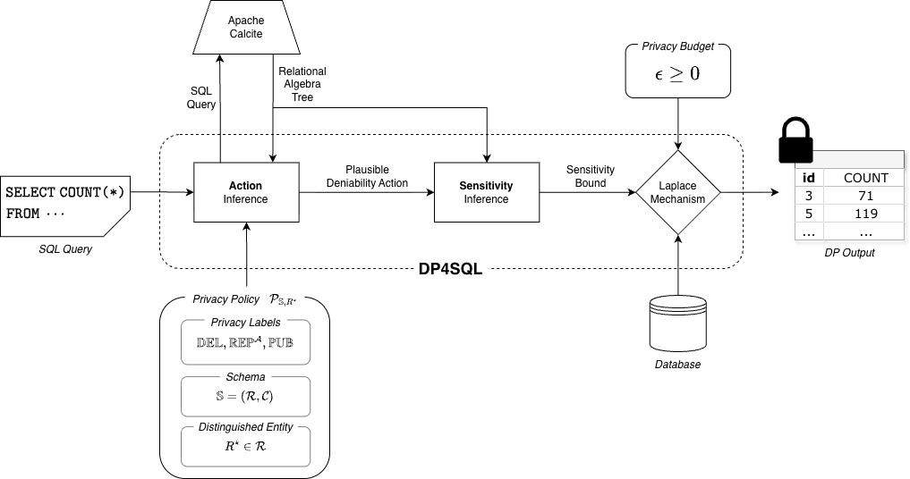

# DP4SQL

This repository contains the artifact to reproduce the results presented in the paper 
"DP4SQL: Differentially Private SQL with Flexible Privacy Policies".

## Introduction

DP4SQL is a differentially private SQL system that allows data curators to better customize the plausible deniability requirements for their relational databases. The user provides a SQL query, a privacy policy, and a privacy budget and DP4SQL computes a sufficient amount of noise that must be added to the query answer in order to satisfy $\epsilon$-differential privacy. We claim the following badges for the paper:

- **Artifacts Available**: This atrifact is available permanently on Zenodo.
- **Artifacts Evaluated** (Reusable): This artifact includes a built-in CLI and supports new schemas, queries, and privacy policies with the addition of just a few configuration files. See the [How to Reuse Beyond the Paper](#how-to-reuse-beyond-the-paper) section.
- **Results Reproduced**: The results of the paper can be reproduced with this artifact. See the [How to Reproduce Results](#how-to-reproduce-results) section.



## Requirements

Before starting, ensure you have the following installed:

- [sbt](https://www.scala-sbt.org/) (Simple Build Tool for Scala)
    - For building the artifact and generating sensitivity and noise values.
- [Jupyter Notebook](https://jupyter.org/install#jupyter-notebook)
    - For reproducing figures with the generated results.
- Python Packages: numpy, matplotlib

### Docker (Optional)

Alternatively, you may create a container from our Docker image which comes with all requirements preconfigured.

```
docker pull casciand/dp4sql
docker run -it casciand/dp4sql bash
```

## How to Reproduce Results

The results of the case study (Section 8) and the TPC-H benchmark evaluation (Section 9) consist of global sensitivities and error distributions for each query for multiple privacy policies. The following shell scripts will regenerate these results. We have included configuration files for both the university and TPC-H schemas, privacy policies, and queries in this artifact.

To reproduce the results from the case study, run

```
results/university.sh
```

To reproduce the results from the TPC-H evaluation, run

```
results/tpch.sh
```

Alternatively, you can reproduce the results directly with sbt

```
sbt "runMain CustomDP4SQL.Interface.QueryRunner src/main/resources/<schema>/config.yaml results/<schema>"
```
replacing `<schema>` with either "university" or "tpch".

### Output

For each query, DP4SQL outputs (1) a .csv file with the sensitivity for each privacy policy and (2) a .csv file with 50 noise samples for each privacy policy. The results will be written into the corresponding `results/university` and `results/tpch` directories. For example, `results/university/q1_sensitivity.csv` should look like

```
baseline1,360
baseline2,792
flex,240
```

and `results/university/q1_noise.csv` should look similar to

```
baseline1,83.0674652218098,-423.60851849226054,-288.8688599875297,-63.92622990966782,-315.7394433587932,21.686498649298432,56.557346164194854,358.64605373218177,277.5264363309026,140.1963618659992,-13.65969961319686,171.6512161329022,314.1887831192904,-502.6103120182816,-421.2925039419622,-648.5484475964354,-133.79052904047458,501.1745139267966,1216.804300303982,465.4517353794621,1405.5368547099781,601.4598805743996,27.086229868551346,244.29344114272624,-58.54648560894461,-87.29382930853393,-247.7246903046304,-980.8019443184879,201.90899405263485,40.70562343109878,250.20016964187138,1211.729287301483,-189.0897334358462,-37.69795741836771,274.8249593884004,-90.33099647415959,-88.65281205998149,665.9779691588346,-261.23556051237523,474.42038401623716,1342.144720325674,82.75019109635359,-115.28617393495847,180.33527280911898,-407.2020955820225,76.79545782467574,-573.4388540718492,231.0079327560549,-286.30476621595744,341.1630366747701
baseline2,-733.6933665644121,1096.4946080957925,-2475.8327077895565,-500.9318706789012,23.18563556956579,1300.777226992643,54.72713981690339,1369.603589305693,-521.1332741527266,-323.80164050077224,-2264.843610521351,-509.83506710909927,523.3934704175674,467.4754781002984,-2831.147924114129,-448.9803731137849,-1341.5387542833755,-14.019939878349236,-62.378453875205416,-208.6848281424791,440.52996913241736,973.7843517106082,-1683.4999457415659,-2067.545516111776,-686.1846449234191,293.0851290186115,151.2524584287305,926.7053062963986,-1803.3193968399933,-649.6114679474477,-3516.296496762604,-1222.3477993752592,-218.52150360820858,-996.9844304776339,-193.56500773145888,2187.553479200061,-1250.5702314367488,2797.3102034427816,-13.055498838581412,-953.4055545593051,481.9187963253805,-260.3328872314126,-89.07978956956194,2324.7032739803226,-391.36457320007116,127.76926194485856,-2043.1051011892812,3330.069780768303,-211.72269588452284,-630.6287206569298
flex,184.35634290717297,594.2428744293154,564.7925304718841,20.038134180133405,-379.88304771573354,-354.49414609228484,-440.7497089683576,-363.2249458443711,-107.43673146660385,506.4803385835038,-220.2446730386362,236.87628755822539,72.69792628498452,-56.17782944105488,539.1983481642811,-195.061386765267,23.281014798226842,27.779755523900505,313.63544737890345,76.49249771717827,293.01992075315576,-362.3198446014981,-46.41132096392419,-398.6792219349953,-470.5703553440461,192.69860424597886,-77.67501105187257,-206.39248696218425,288.8400654164171,366.3092545391848,467.7050894703357,55.699022602353494,-30.718121407389184,164.71374353416232,270.4266637565557,325.6781797567767,-294.928749696543,-286.1313688754309,750.2029714708727,98.16912300323696,33.243380817373136,55.325560843680925,-95.63023530762187,-121.05283202908647,-95.83648522118686,-227.36376129868904,18.61723744788842,36.8483905124813,-188.9632825940178,295.53262364562283
```

up to nondeterminism in exact noise values.

### Reproducing Figures

The Jupyter Notebook at ``results/generate_plots.ipynb`` was used to generate the sensitivity and
error figures in the paper. These figures can be reproduced with

```
jupyter execute results/generate_plots.ipynb
```

which will save the figures in the `results/plots` directory.

*Note: Reproduced error figures may vary slightly due to the inherent nondeterminism of drawing from a probability distribution. Any reproduced figure will still support the claims made in the paper.*

### 

## How to Reuse Beyond the Paper

New schemas, queries, and privacy policies can be added in the `src/main/resources` directory as .yaml files. Examples can be found at `src/main/resources/university` and `src/main/resources/tpch`.

### Schemas

A schema is a list of relations with the following structure:

```
relations:
  - "name": "<relation_name>"
    "identifier": ["<ident1>", "<ident2>", ...]
    "attributes":
      - "name": "<attribute_name>"
        "datatype":
          "name": "string" | "int" | "decimal" | "categorical" | "datetime" | "foreign key"
```

### Privacy Policies

A privacy policy is a list of privacy labels for each relation and maximum frequencies for each attribute:

```
relations:
  - "name": "<relation_name>"
    "global_entity": true | false
    "privacy_policy":
      "name": "DEL" | "REP" | "PUB"
    "attributes":
      - "name": "<attribute_name>"
        "max_frequency": <max_frequency>
```

### Configuration

The list of queries is put in a configuration file that links together the schema and privacy policies:

```
schema_path: "<schema_path>"

privacy_models:
  <policy_name>: "<policy_path>"

queries:
  <query_name>: "<sql_query>"
```

### Command Line Interface

This artifact includes a CLI that supports the following operations for a given schema, set of privacy policies, and set of queries:

1. Viewing the schema's relations.
2. Deriving the relational algebra tree of a query.
3. Computing the sensitivity of a query.
4. Sampling noise to be added to a query answer.

To start, run

```
sbt "runMain CustomDP4SQL.Interface.CommandLineInterface <path_to_config>"
```

replacing ``<path_to_config>`` with the path to your configuration file.